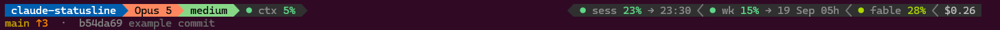

# claude-statusline

Two-line powerline status bar for [Claude Code](https://claude.com/claude-code).



```
folder > [vim] > model > [fast] > effort > [agent] > [style] > ctx %    < session % → reset < week % → reset < Fable % < duration < $cost
⌥ #PR title  ·  branch ↑unpushed ↓behind +n/main *dirty  ·  +added -removed  ·  sha last commit subject
```

Bracketed segments only appear when they apply: vim `NORMAL` mode, fast mode, a sub-agent or remote session, a non-default output style.

- Model pill uses the official Claude colour per model; the effort pill uses the colours of Claude Code's own effort slider.
- Gauges colour the dot and the percentage by level (green → red). The context gauge turns bold red past 90 %, where auto-compaction gets close, and adds `!` beyond the 200k token mark.
- Line 2 counts the lines the session added and removed, next to the git deltas of the working tree.
- Network-bound segments (weekly Fable quota, current PR) are refreshed in the background with a small cache, and fail silently.
- Rendering is pure python3, no `jq`.

## Install

```sh
git clone https://github.com/jweillinfo/claude-statusline ~/dev/claude-statusline
~/dev/claude-statusline/install.sh
```

The installer checks dependencies, symlinks the script to `~/.claude/statusline.sh` and sets `statusLine` in `~/.claude/settings.json`. Manual equivalent:

```json
"statusLine": { "type": "command", "command": "~/.claude/statusline.sh", "padding": 1 }
```

### Dependencies

| | needed for |
|---|---|
| bash, git, python3, curl | everything |
| a [Nerd Font](https://www.nerdfonts.com) | the chevrons |
| `gh` (logged in) | the PR segment, optional |

The weekly Fable quota is read with Claude Code's own OAuth token from `~/.claude/.credentials.json`. It never leaves your machine except to Anthropic's usage endpoint. On macOS the token lives in the Keychain, so that segment is empty there.

### `gh` on WSL

Two common traps:

- **Windows `gh.exe` shadows the Linux one.** WSL appends the Windows PATH, so `command -v gh` may return `/mnt/c/.../gh.exe`. It goes through Windows interop (slow, and the status bar runs it every minute) and uses the Windows login, not your WSL one. Install the Linux `gh` and make sure it wins in PATH.
- **Ubuntu's own `gh` package is old.** Use GitHub's apt repo instead ([instructions](https://github.com/cli/cli/blob/trunk/docs/install_linux.md)). `install.sh` offers to do this for you.

Then `gh auth login`.

## Test

```sh
./test.sh
```

Tested on WSL2 (Ubuntu) with Windows Terminal.

## License

MIT.
